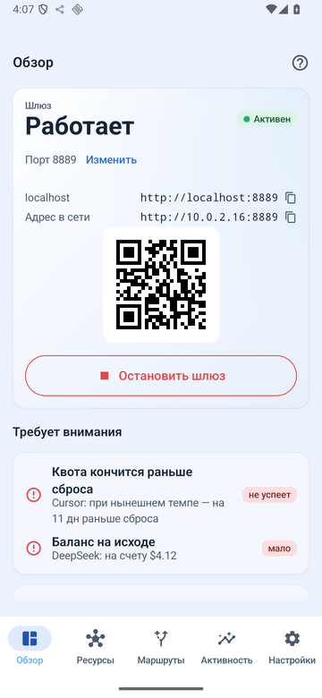
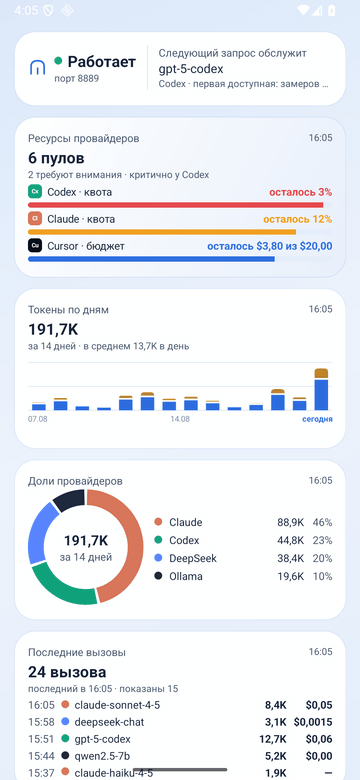
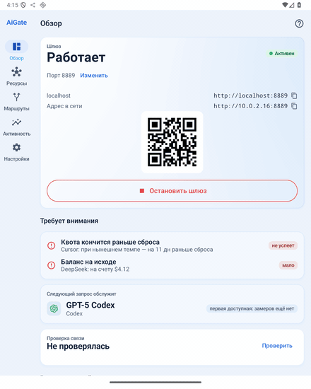
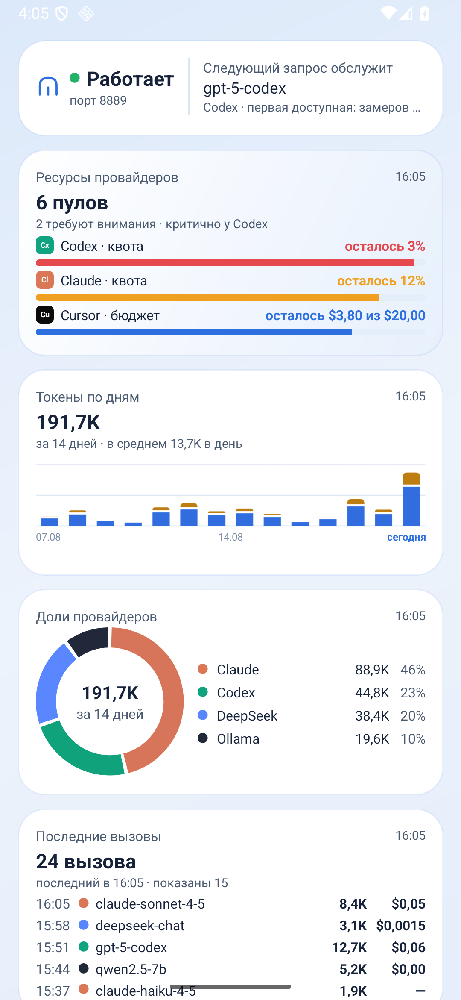
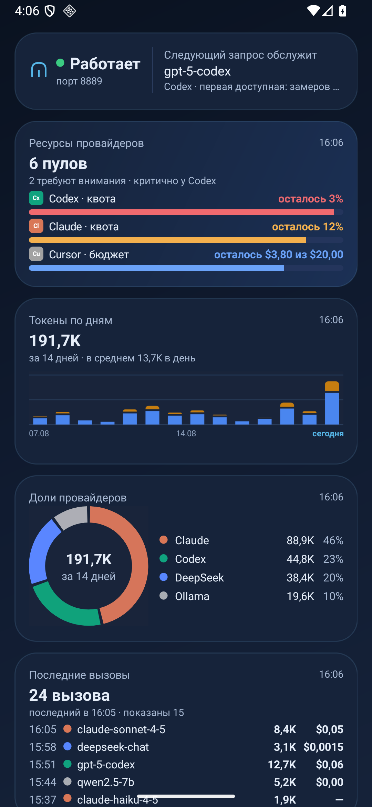

# ИИ Врата (AiGate)

[](https://github.com/Mesteriis/ai-gate/actions/workflows/ci.yml)
[](https://github.com/Mesteriis/ai-gate/releases)
[](LICENSE)


Локальный OpenAI-совместимый **AI-шлюз, менеджер AI-ресурсов и policy-роутер** для
Android. Приложение превращает телефон в маршрутизатор запросов к разным провайдерам
LLM (OpenAI, Anthropic, Gemini, DeepSeek, локальная Ollama, OpenRouter и любые
OpenAI-совместимые эндпоинты) с автоматическим выбором модели, учётом квот/бюджета и
failover.

> **Идея и вдохновение взяты из [QiTong AI Gateway](https://github.com/qtgf520/qitong-ai-gateway)**
> (綦桐AI网关, Apache-2.0). AiGate — форк на базе версии `v3.18.16` (@ `7d7e6ed`),
> из которого удалён «комбайн» (чат, память, персонаж, скиллы, групповой чат,
> веб-поиск), усилена безопасность и добавлен слой управления AI-ресурсами.

**Статус:** `v0.2.0` — рабочий локальный шлюз + AI Resource Manager + локальные
модели (LiteRT-LM, llama.cpp/GGUF, Gemini Nano) + комплект виджетов.

## Скриншоты

<p>
  
  
  
</p>

Слева направо: экраны приложения, виджеты домашнего экрана, большой экран
развёрнутого Z Fold (NavigationRail от 720dp). Статичные снимки всех экранов
в обеих темах — в [docs/SCREENSHOTS.md](docs/SCREENSHOTS.md).

## Позиционирование

AiGate — это инфраструктура доступа к AI, а не AI-клиент. Три независимых слоя:

```
AUTH      →  API-ключи / OAuth / CredentialStore (Keystore)
QUOTA     →  остатки / лимиты / сброс / бюджеты / цены / история
ROUTING   →  выбор оптимального ресурса (скорость / цена / квота / здоровье)
```

Чат, агенты, документы, OCR, память — это задача приложений-потребителей, которые
ходят в AiGate по локальному API. Сам шлюз в это не лезет.

## Возможности

**Шлюз**
- Локальный HTTP-сервер (Ktor CIO) с OpenAI-совместимым API: `/v1/models`,
  `/v1/chat/completions` (стриминг и обычный), `/v1/embeddings`, а также
  Anthropic `/v1/messages`, Gemini `generateContent`, images/audio/rerank и др.
- Виртуальная модель `auto` — шлюз сам выбирает модель (замеры скорости + failover).
  Легаси-идентификатор `qtai-sj` принимается как алиас.
- Именованные стратегии маршрутизации: **Быстро / Дёшево / Качество / Локально /
  По квоте / Авто**.
- Правила маршрутизации (route/block), управление inbound-ключами, исходящие
  прокси (HTTP/SOCKS5) с импортом подписок.

**Безопасность**
- По умолчанию слушает **только `127.0.0.1`** (loopback без авторизации).
- Отдельный защищённый **LAN-режим**: пароль = постоянный Bearer-токен (constant-time
  сравнение), никакого обхода авторизации для RFC1918.
- Секреты — в **Android Keystore** (AES-256-GCM через CryptoBox); в `Provider`/Room/
  бэкапе/логах их нет (только `credentialId`).
- `network_security_config`: cleartext только на loopback/локальную сеть, апстрим — HTTPS.

**Локальные модели**
- Каталог, скачивание и хранилище моделей прямо на устройстве; шлюз обслуживает
  их наравне с облачными (и умеет маршрут «Локально»).
- Три движка: **LiteRT-LM** (`.litertlm`, CPU/GPU/NPU), **llama.cpp** для GGUF
  (собирается из исходников сабмодулем, arm64) и системная **Gemini Nano**
  через AICore — там, где устройство её поддерживает.

**Менеджер AI-ресурсов**
- **Квоты** с честными источниками: `PROVIDER_API` (реальные данные провайдера) vs
  `LOCAL_USAGE`/`USER_CONFIGURED`/`ESTIMATED` (расчёт AiGate) — различаются в UI;
  отсутствие данных показывается как «недоступно», а не выдуманным нулём.
- **Цены и стоимость**: каталог цен (встроенный + пользовательский), оценочная
  стоимость из usage × pricing (всегда помечена как оценка, ≠ баланс провайдера).
- **Бюджеты** и **Resource Pressure** (Свободно/Нормально/Экономить/Критично) с учётом
  времени до сброса и темпа расхода — локальная рекомендация.
- **История расхода** по дням и прогноз на месяц.
- **Домашний виджет** (локальный снимок квот, без сетевого поллинга).
- **Опциональные уведомления** о низком остатке (пороги настраиваются).
- **OAuth Credential Framework** (single-flight refresh) — каркас для OAuth-провайдеров.
- **CLI-сессии** (эксперим.): импорт сохранённой сессии CLI провайдера (Codex/Gemini/
  Claude), хранение в Keystore + автообновление — как в omniroute.

## Подключение провайдеров

1. **API-ключ** (основной путь): вкладка **Ресурсы → Подключить провайдера**,
   укажите тип, Base URL и ключ. Работает с OpenAI, Anthropic, Gemini, DeepSeek,
   OpenRouter, локальной Ollama (без ключа) и любым OpenAI-совместимым сервисом.
   Ключ шифруется в Keystore.
2. **Реальные остатки**: адаптеры квот встроены для OpenRouter (баланс счёта),
   Codex (квота подписки ChatGPT), Claude (квота подписки двумя окнами),
   DeepSeek (баланс) и Cursor (расход команды) — на «Обзоре» и вкладке
   «Ресурсы» такие данные помечены как данные провайдера (`PROVIDER_API`).
   Для остальных показывается честный локальный подсчёт — только по запросам
   через шлюз.
3. **Ollama**: Base URL вида `http://<host>` + порт `11434`, ключ не нужен
   (cleartext к локальной сети разрешён).

4. **Codex в один тап** (эксперим., по образцу omniroute): «Ресурсы →
   Подключить провайдера → **Codex (ChatGPT)**». Одна кнопка — открывается браузер на входе
   OpenAI Codex (настоящий OAuth Authorization Code + PKCE, публичный client_id из
   codex CLI). Логинитесь своей учётной записью ChatGPT, провайдер редиректит на
   **`http://localhost:1455/auth/callback`** (порт фиксированный — как у codex CLI),
   AiGate поднимает loopback-сервер на 1455, ловит код, меняет на токены и сохраняет
   их в Keystore. Дальше сессия **переиспользуется как Bearer и автоматически
   обновляется** (single-flight refresh переживает перезапуск). Ничего копировать не
   нужно. После входа автоматически: **читаются модели** Codex (gpt-5-codex, gpt-5,
   o3, o4-mini, codex-mini-latest) и **подтягивается реальная квота подписки** из
   `GET /backend-api/codex/usage` (остаток в %, время до сброса, план) — на вкладке
   «Ресурсы» и на «Обзоре» с пометкой «данные провайдера» (`PROVIDER_API`). Кнопка «Другой
   провайдер…» даёт тот же браузерный flow для Gemini/Claude/своего OAuth (плюс
   fallback «Вставить сессию вручную»).

> **Про Codex / ChatGPT- и Claude-подписки.** Публичного OAuth-flow и API остатка
> подписки для сторонних клиентов OpenAI/Anthropic не дают, поэтому «Codex 80%» через
> обычный API получить нельзя. Путь через **CLI-сессию** (п. 4) работает, но
> использование приватных эндпоинтов провайдера сторонним клиентом может нарушать их
> Terms — это на ваш риск и помечено как экспериментальное. Всегда доступный
> безопасный путь — их **API-ключи** (`api.openai.com`, `api.anthropic.com`) как
> обычные провайдеры с учётом usage и оценочной стоимости.

## Домашние виджеты

Долгое нажатие на рабочем столе → **Виджеты** → **AiGate** → перетащите нужный.
Виджеты читают локальный снимок из БД и обновляются после запросов и по расписанию
(WorkManager), без постоянного поллинга и без обращений к сети.

| Виджет | Размеры | Что показывает |
|---|---|---|
| AiGate — ресурсы | 2×1 … 4×4 | пулы провайдеров: остаток, давление, сброс и вердикт по темпу |
| AiGate — окна квоты | 2×2 … 4×4 | два лимита одновременно: сессия и неделя |
| AiGate — темп расхода | 2×2 … 4×4 | линия остатка квоты и вердикт: хватит до сброса или сгорит |
| AiGate — токены по дням | 2×2 … 4×4 | входные и выходные токены стопкой за две недели |
| AiGate — расход за месяц | 2×2, 4×2 | накопительная линия факта и пунктир прогноза |
| AiGate — трафик | 2×2, 4×2 | получено и отправлено, две спарклайны |
| AiGate — доли провайдеров | 2×2, 4×2 | донат расхода с легендой в фирменных цветах |
| AiGate — топ моделей | 4×2, 4×4 | ранжирование моделей, цвет бара — провайдер |
| AiGate — последние вызовы | 4×2, 4×4 | таблица: время, модель, токены, расход |
| AiGate — расход по ключам | 4×2, 4×4 | какой API-ключ сколько израсходовал |
| AiGate — скорость | 2×1 … 4×2 | медианы времени первого токена и потока токенов |
| AiGate — статус шлюза | 2×1, 4×1 | работает или остановлен, порт и следующая модель |

Виджет подстраивается под размер: на 2×1 остаётся одна строка, на 4×4 появляются
графики, легенды и футер со свежестью снимка. Число строк считается по фактической
высоте экземпляра, а не по ярусу, — лаунчеры дают очень разные размеры. Если строк
больше, чем влезает, список внутри виджета **прокручивается** (Android 12 и новее;
на более старых системах строки просто обрезаются по месту). Темы светлая и тёмная
переключаются вслед за системной.

<p>
  
  
</p>

Полная галерея — каждый виджет во всех ярусах, светлая и тёмная темы — в
[docs/SCREENSHOTS.md](docs/SCREENSHOTS.md). Макеты, из которых собран комплект,
лежат в [docs/design/widgets](docs/design/widgets/) — самостоятельные
HTML-страницы со всеми размерами в двух темах (точка входа — `index.html`).

Инварианты, которые комплект держит вместе с экранами: заливка бара и кольца —
израсходованное, подпись всегда про остаток; отсутствие данных показывается
прочерком, а не нулём; тип ресурса называется своим словом (квота, баланс,
бесплатно, бюджет); подсказок и инструкций на виджете нет.

## Локальный API — быстрый старт

```bash
# на телефоне запущен шлюз (порт 8889 по умолчанию)
curl http://127.0.0.1:8889/v1/models
curl http://127.0.0.1:8889/v1/chat/completions \
  -H 'Content-Type: application/json' \
  -d '{"model":"auto","messages":[{"role":"user","content":"привет"}],"stream":true}'
```

В LAN-режиме укажите заголовок `Authorization: Bearer <ваш-пароль>`.

## Установка

Готовый APK лежит в [Releases](https://github.com/Mesteriis/ai-gate/releases):
на каждый тег `v*` CI собирает релиз и прикладывает APK с контрольной суммой.
Также свежий debug APK можно взять из артефактов последнего запуска
[CI](https://github.com/Mesteriis/ai-gate/actions/workflows/ci.yml).

## Сборка

Требуется JDK 17 и Android SDK (compileSdk/targetSdk 37). Движок llama.cpp
собирается из исходников, поэтому клонируйте с подмодулями (NDK и CMake 3.31.6
Android Gradle Plugin поставит сам):

```bash
git clone --recurse-submodules https://github.com/Mesteriis/ai-gate.git
export JAVA_HOME=/path/to/jdk-17
export ANDROID_HOME=$HOME/Library/Android/sdk   # или свой путь к SDK
./gradlew assembleDebug                  # debug APK
./gradlew lintDebug testDebugUnitTest    # линт + юнит-тесты (гейт CI)
```

APK появится в `app/build/outputs/apk/debug/`. Для релизной подписи задайте
`AIGATE_KEYSTORE_PATH`, `AIGATE_STORE_PASSWORD`, `AIGATE_KEY_ALIAS`,
`AIGATE_KEY_PASSWORD` (ключ в репозиторий не коммитится). В CI релиз
подписывается ключом из секретов `RELEASE_KEYSTORE_BASE64` /
`RELEASE_STORE_PASSWORD` / `RELEASE_KEY_ALIAS` / `RELEASE_KEY_PASSWORD`;
без них — одноразовым ключом (APK устанавливается, но identity подписи не
постоянная).

Участие в разработке — [CONTRIBUTING.md](CONTRIBUTING.md), журнал изменений —
[CHANGELOG.md](CHANGELOG.md), безопасность — [SECURITY.md](SECURITY.md).

## Отличия от апстрима (QiTong)

- Удалены чат-клиент, память/персонаж, скиллы/инструменты, групповой чат и веб-поиск —
  оставлен только API-шлюз.
- Виртуальная модель `qtai-sj` → `auto`; бренд/пакет → `com.aigate.router`.
- Loopback по умолчанию + защищённый LAN-режим; убран обход авторизации для RFC1918.
- Секреты → Android Keystore; из `Provider`/бэкапа/логов секрет удалён.
- Закрыта дыра с отключённой проверкой TLS у HTTPS-прокси; добавлен
  `network_security_config`.
- Нормализован OpenAI-совместимый API (error-envelope, статусы, route-action,
  tool_calls, идемпотентные ретраи, реальная версия).
- Удалена автоотправка крашей в чужой GitHub и чтение токена из `/tmp/.git_token`.
- Полностью русский интерфейс, тема «врат», адаптивная раскладка (NavigationRail на
  большом экране).
- Добавлен слой AI Resource Manager (квоты, цены, бюджеты, routing по ресурсам,
  история, уведомления, OAuth-каркас) и адаптеры реальных квот
  (OpenRouter/Codex/Claude/DeepSeek/Cursor).
- Добавлены локальные модели (LiteRT-LM, llama.cpp/GGUF, Gemini Nano/AICore)
  и комплект из двенадцати домашних виджетов.

## Лицензия

Apache License 2.0 — см. [LICENSE](LICENSE) и [NOTICE](NOTICE). Форк сохраняет
лицензию исходного проекта QiTong AI Gateway.

---

## English

**AiGate (ИИ Врата)** is a local, OpenAI-compatible **AI gateway, AI-resource manager
and policy router** for Android. It turns the phone into a request router across
multiple LLM providers (OpenAI, Anthropic, Gemini, DeepSeek, Ollama, OpenRouter and
any OpenAI-compatible endpoint) with automatic model selection, quota/budget awareness
and failover.

Idea and inspiration are taken from
[QiTong AI Gateway](https://github.com/qtgf520/qitong-ai-gateway) (Apache-2.0). AiGate
is a fork of upstream `v3.18.16` (@ `7d7e6ed`) with the non-gateway "combine" features
removed, security hardened (loopback default, secure LAN, Keystore secrets), and an
AI-resource layer added (quotas, pricing/cost, resource-aware routing, usage history,
a 12-widget home-screen kit, notifications, OAuth framework). Since `v0.2.0` it also
runs **on-device models** — LiteRT-LM, llama.cpp/GGUF (built from source as a
submodule) and Gemini Nano via AICore. Screenshots for phone, unfolded-foldable and
widgets live in [docs/SCREENSHOTS.md](docs/SCREENSHOTS.md).

**Provider connection.** Add providers by API key (Resources → Add provider). Built-in
real-quota adapters cover OpenRouter (account balance), Codex (ChatGPT subscription
quota), Claude (subscription quota, two windows), DeepSeek (balance) and Cursor (team
spend) — such data is labeled `PROVIDER_API`; everything else shows an honest local
count of gateway traffic. Codex connects in one tap via a real browser OAuth flow
(Authorization Code + PKCE, loopback port 1455); Claude/Gemini use the same
experimental CLI-session path. Note: OpenAI/Anthropic expose no public subscription
API to third-party clients, so the CLI-session path may violate their Terms — use at
your own risk; their **API keys** always work as normal providers.

Install a prebuilt APK from [Releases](https://github.com/Mesteriis/ai-gate/releases)
(CI builds and attaches one for every `v*` tag), or build from source with JDK 17 +
Android SDK: `git clone --recurse-submodules … && ./gradlew assembleDebug`. Licensed
under Apache-2.0 (see `LICENSE`/`NOTICE`); the fork keeps the upstream license.
